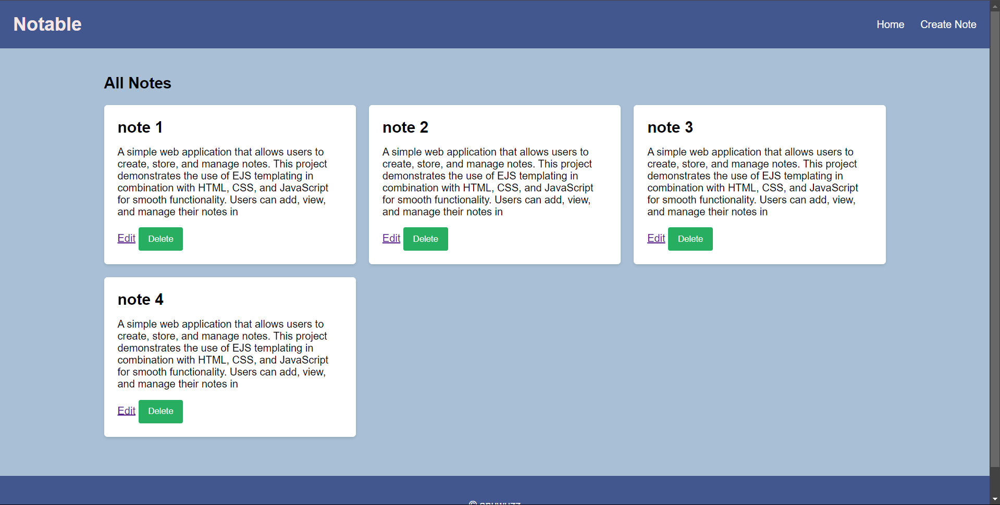
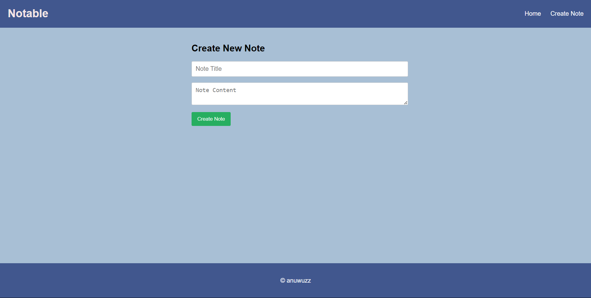
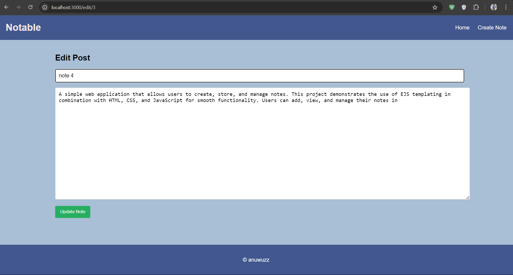

# 📝 Notable 📒

## 📖 Overview
**Notable** is a simple web application that allows users to create, store, and manage notes effortlessly. This project demonstrates the use of **EJS templating** alongside **HTML**, **CSS**, and **JavaScript** for smooth functionality. Users can add, view, and manage their notes in an intuitive and user-friendly interface. ✨🖊️

## 📸 Screenshots
  
  
  

## 🚀 How to Clone and Run

### 📋 Prerequisites
Make sure you have **Node.js** installed on your machine. You can download it from [Node.js Official Website](https://nodejs.org/).

### 🔧 Installation Steps:
1. **Clone the repository**:
   ```bash
   git clone https://github.com/yourusername/your-repository.git
   ```
2. **Navigate into the project folder**:
   ```bash
   cd your-repository
   ```
3. **Install dependencies**:
   ```bash
   npm install
   ```
4. **Run the server**:
   ```bash
   node server.js
   ```
5. **View the app in your browser**: http://localhost:3000
